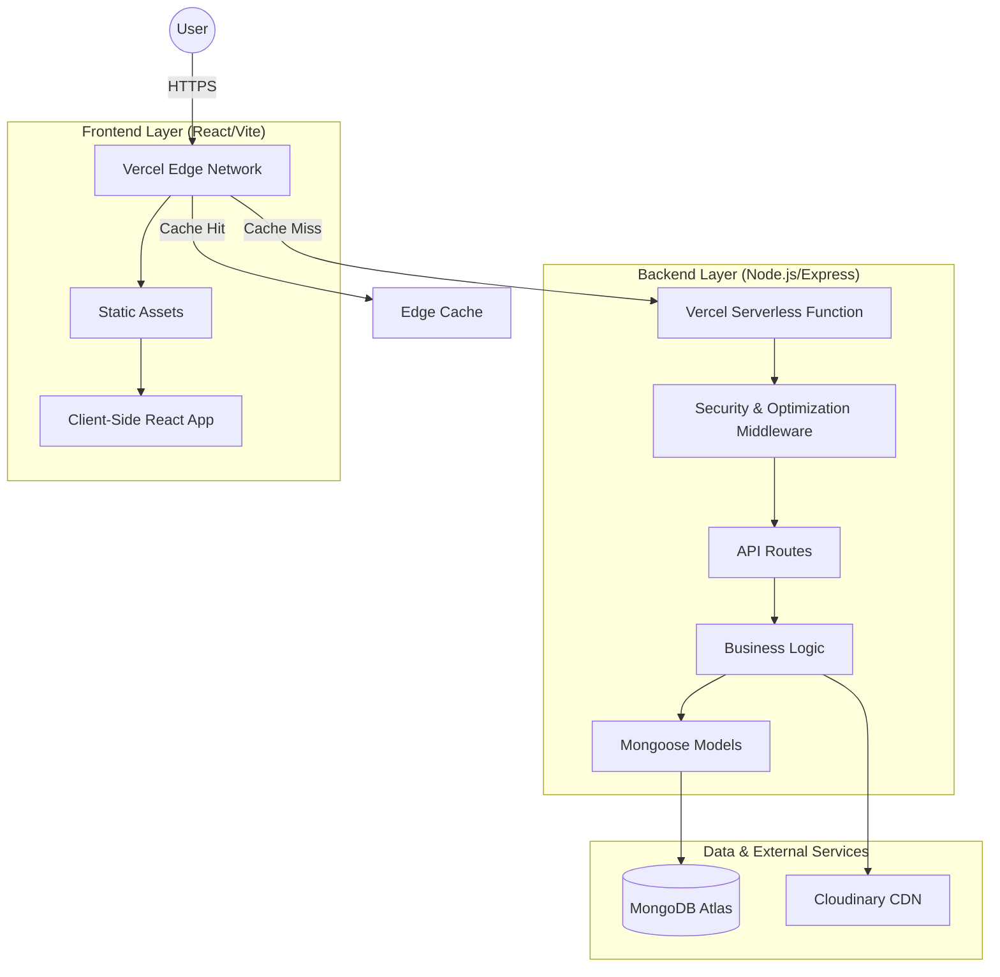
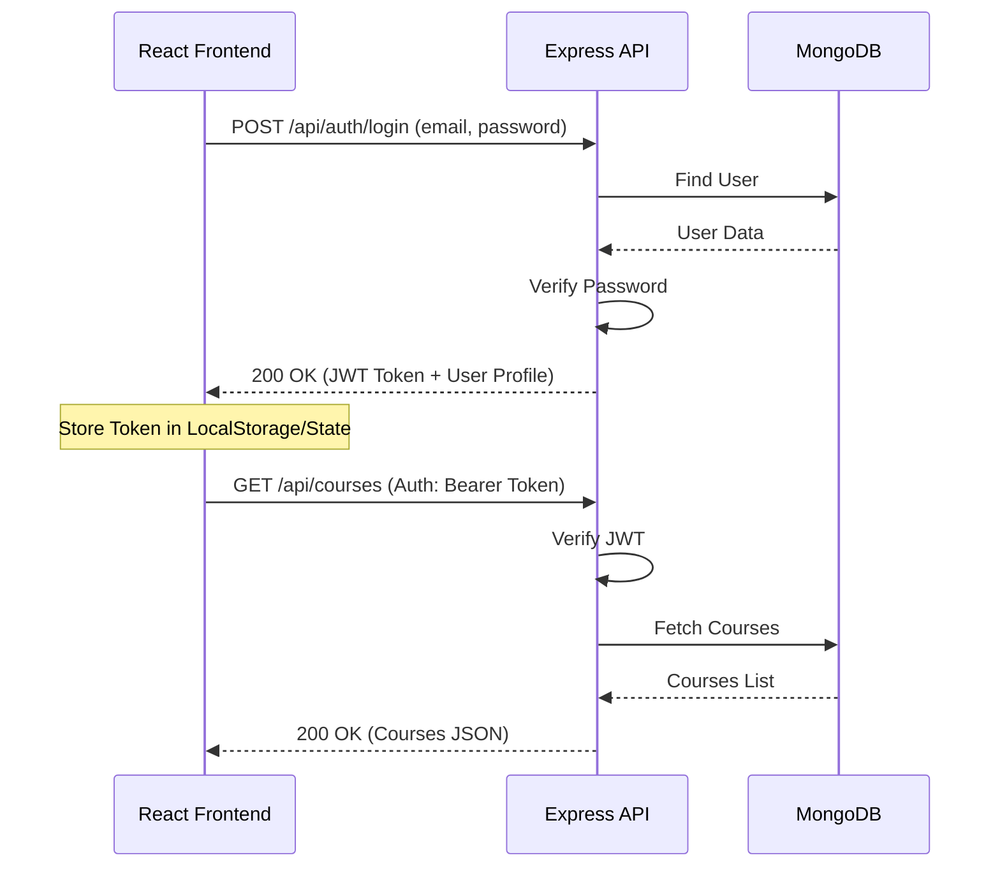

# Comprehensive System Architecture - EduTech Platform

This document provides an exhaustive deep-dive into the architectural design, technology stack, and infrastructure of the EduTech platform.

---

## 1. Architectural Overview

The EduTech platform is built on a **High-Performance MERN Stack** (MongoDB, Express, React, Node.js) with a **Hybrid Server/Serverless Strategy**. It is designed to be globally scalable, secure, and SEO-optimized.

### High-Level Component Interaction

---

## 2. Infrastructure & Deployment (Vercel Deep-Dive)

The platform leverages Vercel's infrastructure for both frontend hosting and backend execution.

### Infrastructure Strategy (`vercel.json`)
- **Single Function API**: All `/api/*` routes are handled by `api/index.js`, reducing cold start overhead across multiple functions.
- **CDN Proxying**: Requests to `/cdn/:path*` are transparently proxied to Cloudinary. This allows the app to serve media from a consistent domain, improving SEO and simplifying CORS management.
- **Global Headers**:
    - **Security**: Strict CSP (Content Security Policy), HSTS, and X-Frame-Options.
    - **Performance**: `Cache-Control` headers for assets are set to `public, max-age=31536000, immutable`.
- **Edge Caching**: API responses use `s-maxage=60, stale-while-revalidate=300` for high availability and low latency.

---

## 3. Backend Architecture (Node.js/Express)

The backend is engineered for resilience and security, supporting two runtime modes: **Standalone Server** and **Serverless**.

### Dual-Mode Execution
1. **Cluster Mode (`backend/server.js`)**: Uses the Node.js `cluster` module to spawn worker processes for every CPU core. This is intended for VPS or Containerized deployments.
2. **Serverless Mode (`api/index.js`)**: Optimized for AWS Lambda (via Vercel). Includes specific logic to handle transient database connections and cold starts.

### Middleware Pipeline (Order of Execution)
1.  **Security Layer (`security.js`)**: 
    - `Helmet`: Sets 15+ secure HTTP headers.
    - `CORS`: Strict origin validation with credentials support.
    - `mongoSanitize`: Prevents NoSQL injection by stripping `$` and `.` from inputs.
    - `XSS-Clean`: Sanitizes user input to prevent Cross-Site Scripting.
    - `HPP`: Prevents HTTP Parameter Pollution.
2.  **Performance Layer**:
    - `Compression`: Uses Gzip to reduce response sizes.
    - `Cookie-Parser`: Handles secure session management.
3.  **Stability Layer**:
    - **Global Rate Limiter**: 10,000 requests / 15 mins (Default).
    - **Auth Rate Limiter**: 5,000 requests / 15 mins (Stricter).
    - **Request Timeout**: Prevents hanging requests from exhausting resources.
4.  **Routing Layer**: Standardized Express routes (`/api/auth`, `/api/courses`, etc.).
5.  **Error Layer (`errorHandler.js`)**: Centralized error management that standardizes responses for Mongoose Validation Errors, Duplicate Keys, and JWT issues.

---

## 4. Frontend Architecture (React/Vite)

The frontend is a modern SPA (Single Page Application) optimized for speed and interactivity.

### Technical Stack
- **Build Engine**: Vite (Rollup-based production builds).
- **Language**: TypeScript (Strict mode).
- **Styling**: PostCSS with custom CSS variables for a consistent design system.
- **State Management**: Service-based architecture in `src/app/services`.

### Key Directories
- `src/app/pages`: Contains main route components (Home, Courses, Blog, etc.).
- `src/app/components`: Atomic UI components (Buttons, Inputs, Modals).
- `src/app/services`: Encapsulated API logic using Axios.
- `src/app/utils`: Common helper functions.

---

## 5. Data Model & Storage

### MongoDB Schema Design
The system uses Mongoose for structured data management.
- **Core Models**: `User`, `Course`, `BlogPost`, `CategoryTag`, `Instructor`.
- **Relationship Models**: `CourseEnrollment`, `CourseModule`, `EventRegistration`.
- **System Models**: `ActivityLog`, `SiteSettings`.

### Media Strategy
- **Cloudinary Integration**: No files are stored locally.
- **Upload Flow**: 
    1. Client sends file to `/api/upload`.
    2. Server buffers file in RAM (Multer MemoryStorage).
    3. Server streams file to Cloudinary.
    4. Database stores only the Cloudinary URL.

---

## 6. API & Integration Guide

The frontend communicates with the backend via a RESTful JSON API.

### Authentication Flow (JWT)

### Key Endpoints
- **Auth**: `/api/auth/login`, `/api/auth/register`, `/api/auth/profile`.
- **Courses**: `/api/courses` (List), `/api/courses/:id` (Detail), `/api/courses/:id/enroll`.
- **Blog**: `/api/blog` (List), `/api/blog/:slug` (Detail).
- **Events**: `/api/events` (List), `/api/events/:id/register`.

---

## 7. Admin & Management Systems

### Integrated Admin Panel
- **Custom Router**: The platform includes a specialized admin system managed via `backend/admin/adminConfig.js`.
- **Dashboard**: Accessible via `/admin-panel`, providing direct control over courses, users, and blog content.

### Maintenance Utilities
A suite of CLI tools in the `backend/` directory allows for direct DB management:
- `debug_db.js`: Inspects database state.
- `verify-slugs.js`: Ensures SEO-friendly URLs are consistent.
- `check_db_data.js`: Validates data integrity.

---

## 8. Security Policy Summary

| Feature | Implementation |
| :--- | :--- |
| **Authentication** | JWT (JSON Web Tokens) with Secure HTTP-Only Cookies |
| **Data Integrity** | Mongoose Schema Validation + NoSQL Sanitization |
| **API Protection** | `express-rate-limit` + Request Timeouts |
| **Browser Security** | Custom CSP Directives (strict-dynamic equivalent) |
| **CDN Security** | Cloudinary Signed Uploads (configured via API) |
